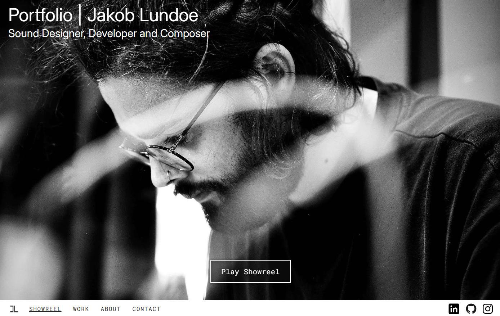

### Description
This is the repository for the development of my portfolio website.

The basic goal is to build a functioning static website which serves the purpose of presenting my work. The requirement is that the website needs to be build in modules with the functionality of being easily adjusted giving the ability to add functionality and content in the future. Lastly I wanted to host it on my own linux server (using nginx web server).

**Tools, languages and frameworks used:**  
Hugo as the SSG 
Figma as the design tool 
CSS, HTML and a little JS 
Git as the version control tool 
Obsidian as my project management tool!

### Img

